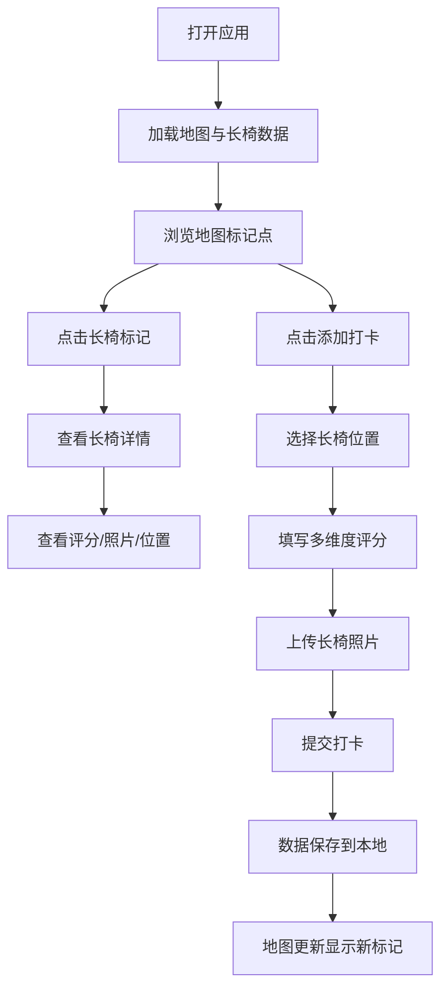

## 1. 产品概述

公园石凳舒适度测评地图是一款面向城市遛弯族的长椅/石凳打卡评测工具。用户可在城市各公园发现并标记长椅位置，记录坐感舒适度、遮阴情况、视野好坏等多维度评分，上传实景照片，帮助其他散步爱好者快速找到最佳歇脚点。

- 核心价值：让城市漫步更舒适，为遛弯族提供可信赖的长椅参考指南
- 目标用户：城市公园散步人群、户外爱好者、老年遛弯群体
- 产品定位：轻量级地图打卡工具，专注于公园长椅舒适度评测

## 2. 核心功能

### 2.1 用户角色

| 角色 | 注册方式 | 核心权限 |
|------|----------|----------|
| 普通用户 | 无需注册，本地存储 | 浏览地图、查看长椅详情、添加新长椅打卡、提交评分和照片 |

### 2.2 功能模块

1. **地图首页**：交互式地图展示、长椅标记点、评分筛选、定位功能
2. **长椅详情面板**：综合评分展示、多维度评分详情、照片墙、位置信息
3. **打卡添加页**：位置选择、坐感评分、遮阴评分、视野评分、照片上传、备注信息
4. **评分筛选器**：按综合评分筛选、按单项维度筛选、按公园名称搜索

### 2.3 页面详情

| 页面名称 | 模块名称 | 功能描述 |
|----------|----------|----------|
| 地图首页 | 地图交互区 | Leaflet 开源地图、缩放控制、当前定位、长椅标记点集群 |
| 地图首页 | 顶部导航栏 | 应用 Logo、搜索框、筛选按钮、添加打卡按钮 |
| 地图首页 | 筛选侧边栏 | 综合评分筛选、坐感/遮阴/视野单项筛选、重置按钮 |
| 长椅详情 | 评分概览卡 | 综合星级评分、三项维度评分条、打卡人数 |
| 长椅详情 | 照片展示区 | 长椅实景照片轮播、点击放大查看 |
| 长椅详情 | 位置信息卡 | 公园名称、具体位置描述、导航按钮 |
| 打卡添加页 | 位置选择 | 地图选点、自动获取当前位置、公园名称输入 |
| 打卡添加页 | 评分表单 | 坐感舒适度（1-5星）、遮阴情况（1-5星）、视野好坏（1-5星） |
| 打卡添加页 | 照片上传 | 支持拍照或从相册选择、多图上传、预览删除 |
| 打卡添加页 | 备注信息 | 长椅类型（石凳/木椅/其他）、补充说明文字 |

## 3. 核心流程

用户打开应用后，默认展示当前城市公园地图，地图上分布着不同颜色的长椅标记点（颜色代表综合评分高低）。用户可以缩放浏览地图，点击标记点查看长椅详情。若想分享新发现的长椅，可点击添加按钮，选择位置后填写评分和照片完成打卡。

## 4. 用户界面设计

### 4.1 设计风格

- **主色调**：森林绿 `#2D6A4F` — 传达自然、公园、舒适的品牌感
- **辅助色**：暖琥珀 `#F4A261` — 用于强调按钮、评分星级、标记点
- **中性色**：米白背景 `#F8F5F0`、深灰文字 `#2D3436`、浅灰边框 `#DFE6E9`
- **按钮风格**：圆润胶囊型按钮，主按钮为森林绿填充配白色文字，悬停有微上浮阴影效果
- **字体选择**：标题使用 Lora 衬线字体（优雅、人文感），正文使用 Inter 无衬线字体（清晰易读）
- **布局风格**：卡片式布局，柔和圆角（12px），轻量级阴影，营造温馨舒适的视觉感受
- **图标风格**：Lucide 线性图标，统一 2px 描边，与整体轻盈风格匹配
- **动效设计**：标记点弹跳入场、卡片悬停微放大、评分星星点亮动效、侧滑抽屉过渡

### 4.2 页面设计概述

| 页面名称 | 模块名称 | UI 元素 |
|----------|----------|----------|
| 地图首页 | 顶部导航栏 | 渐变绿色背景、圆角搜索框、透明按钮、阴影过渡 |
| 地图首页 | 地图标记点 | 圆形标记 + 星级徽章、评分颜色渐变、悬停放大 |
| 地图首页 | 底部浮动卡 | 当前选中长椅摘要、上滑展开详情、毛玻璃效果 |
| 长椅详情 | 评分卡片 | 大号综合评分、彩色进度条、维度图标 |
| 长椅详情 | 照片墙 | 横向滚动照片条、圆角缩略图、点击放大 |
| 打卡添加页 | 评分组件 | 五星交互评分、表情辅助提示、选中动画 |
| 打卡添加页 | 上传区域 | 虚线框拖放区、相机图标、缩略图网格 |

### 4.3 响应式

- 采用桌面端优先设计，移动端自适应
- 地图区域始终占满视口，交互控件悬浮于地图之上
- 移动端：侧边栏转为底部抽屉式布局，按钮放大至 44px 触控区域
- 桌面端：左右分栏布局，左侧筛选 + 详情面板，右侧全屏地图
- 支持触摸手势：双指缩放地图、滑动切换照片、下拉关闭面板

### 4.4 地图场景指引

- **底图样式**：使用 OpenStreetMap 标准底图，叠加公园绿地高亮图层
- **标记点样式**：圆形气泡标记，填充色根据综合评分从红到绿渐变，边框为白色描边
- **信息弹窗**：点击标记弹出简洁卡片，显示长椅照片缩略图和综合评分
- **视角控制**：默认展示当前城市范围，支持平滑缩放过渡动画
- **集群显示**：长椅密集区域自动聚合为数字集群，缩放后展开
