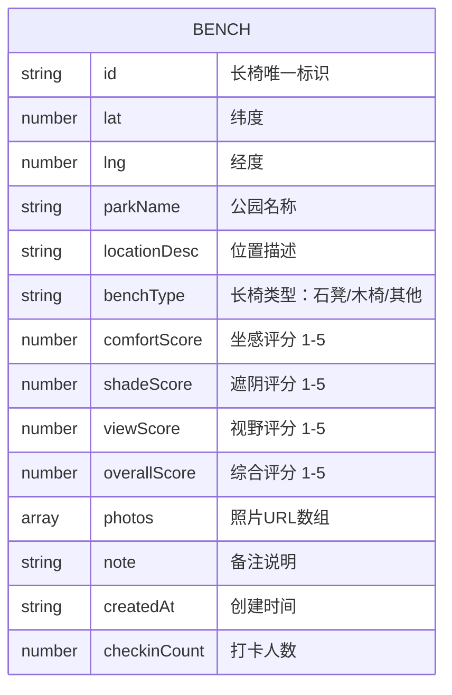

## 1. 架构设计

本项目为纯前端单页应用，采用 React + Vite 构建，地图能力基于 Leaflet 开源地图库，数据持久化使用浏览器 LocalStorage。整体采用分层架构，确保组件职责清晰、数据流向明确。


## 2. 技术描述

- **前端框架**：React@18 + TypeScript + Vite
- **初始化工具**：vite-init (react-ts 模板)
- **地图引擎**：Leaflet@1.9 + react-leaflet@4 — 轻量级开源地图库，支持标记点、弹窗、缩放等交互
- **状态管理**：zustand — 轻量级状态管理，管理长椅数据、筛选条件、当前选中项
- **样式方案**：tailwindcss@3 — 原子化 CSS，快速构建响应式界面
- **图标库**：lucide-react — 线性图标库，风格统一
- **后端服务**：无后端，纯前端应用
- **数据存储**：LocalStorage 本地存储，初始数据使用 Mock 数据
- **路由**：react-router-dom — 管理页面路由（地图首页、打卡添加页）

## 3. 路由定义

| 路由 | 用途 |
|------|------|
| `/` | 地图首页 - 展示长椅标记、筛选、详情面板 |
| `/add` | 打卡添加页 - 位置选择、评分表单、照片上传 |

## 4. 数据模型

### 4.1 数据模型定义



### 4.2 数据类型定义

```typescript
// 长椅类型
type BenchType = 'stone' | 'wood' | 'other';

// 评分项
interface Scores {
  comfort: number;  // 坐感 1-5
  shade: number;    // 遮阴 1-5
  view: number;     // 视野 1-5
}

// 长椅数据
interface Bench {
  id: string;
  lat: number;
  lng: number;
  parkName: string;
  locationDesc: string;
  benchType: BenchType;
  comfortScore: number;
  shadeScore: number;
  viewScore: number;
  overallScore: number;
  photos: string[];
  note: string;
  createdAt: string;
  checkinCount: number;
}

// 筛选条件
interface FilterOptions {
  minOverallScore: number;  // 最低综合评分
  minComfortScore: number;  // 最低坐感评分
  minShadeScore: number;    // 最低遮阴评分
  minViewScore: number;     // 最低视野评分
  searchKeyword: string;    // 搜索关键词
  benchTypes: BenchType[];  // 长椅类型筛选
}
```

### 4.3 Mock 初始数据

预置 8-12 条长椅数据，分布在城市各公园，覆盖不同评分档位，包含示例照片，确保首次打开即可看到丰富的地图内容。

## 5. 项目目录结构

```
src/
├── components/
│   ├── Map/              # 地图相关组件
│   │   ├── BenchMarker.tsx
│   │   └── MapView.tsx
│   ├── BenchDetail/      # 长椅详情组件
│   │   ├── ScoreCard.tsx
│   │   ├── PhotoGallery.tsx
│   │   └── BenchDetailPanel.tsx
│   ├── Filter/           # 筛选组件
│   │   └── FilterSidebar.tsx
│   ├── AddBench/         # 添加打卡组件
│   │   ├── RatingStars.tsx
│   │   ├── PhotoUploader.tsx
│   │   └── AddBenchForm.tsx
│   └── UI/               # 通用UI组件
│       ├── Button.tsx
│       └── Card.tsx
├── pages/
│   ├── MapPage.tsx       # 地图首页
│   └── AddBenchPage.tsx  # 打卡添加页
├── store/
│   └── useBenchStore.ts  # Zustand 状态管理
├── data/
│   └── mockBenches.ts    # Mock 初始数据
├── utils/
│   ├── score.ts          # 评分计算工具
│   └── storage.ts        # 本地存储工具
├── types/
│   └── bench.ts          # 类型定义
├── App.tsx
├── main.tsx
└── index.css
```
